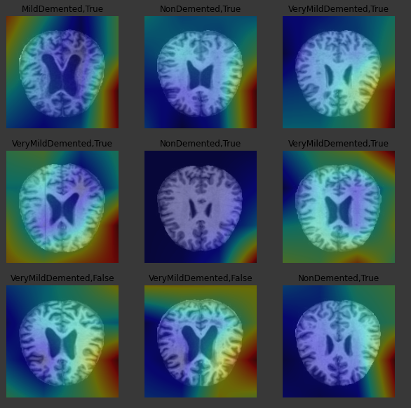

## Alzheimer's Disease Diagnosis With Deep Learning (CNN)
### Model description :
built with pretrained inception-resnet-v2 model (which enables us to predict low-level features like edges
and curves, right from the start so it shortens the learning phase), and extra fully connected layers on top of that.
#### Accuracy on the test-set achieved with only 10 epochs : <b> 87.14% AUC</b> metric accuracy.
### Dataset used : 
https://www.kaggle.com/tourist55/alzheimers-dataset-4-class-of-images
### Predictions Showcase :

